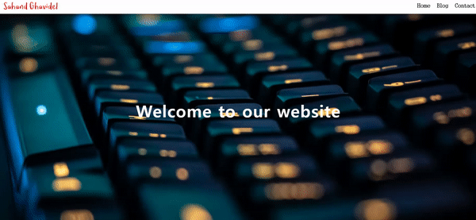

# Sticky-Navbar

## 효과  
웹 페이지의 스크롤을 내리면 navbar가 고정되고, 일정 부분이 지나면 배경색이 변화   

## 학습출처
**유튜브**    
https://www.youtube.com/@JavaScriptKing     

**이미지 가져오기**         
https://images.unsplash.com/    

